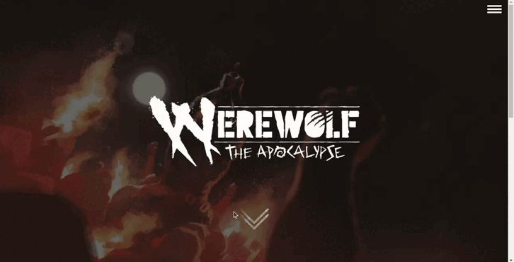

# Segredos da Fúria: Explorando o Mundo de "Wherewolf: the Apocalypse 5th"

  

<h3 align="center">https://segredosdafuria.vercel.app/</h3>

Bem-vindo ao **Segredos da Fúria**, uma aplicação emocionante que permite aos jogadores e fãs de "Wherewolf: the Apocalypse 5th" explorar o rico universo sobrenatural deste cenário de RPG. Com a capacidade de acessar informações detalhadas sobre tribos, augúrios, rituais e dons, esta aplicação traz à vida as nuances e mistérios deste mundo fascinante.

## Sobre "Wherewolf: the Apocalypse 5th"

"Wherewolf: the Apocalypse 5th" é um cenário de RPG que mergulha os jogadores em um mundo onde seres humanos com o espírito de lobos podem se transformar em lobisomens poderosos, conhecidos como Garou. Esses Garou são os defensores naturais do mundo contra forças sobrenaturais corruptas, enquanto também enfrentam a destruição ambiental e a decadência espiritual da humanidade.

## Tecnologias Utilizadas

O Segredos da Fúria foi desenvolvido usando tecnologias modernas, incluindo:

- **React**: Uma biblioteca JavaScript para construção de interfaces de usuário interativas.
- **Next.js**: Um framework React que oferece renderização do lado do servidor, geração de páginas estáticas e outras funcionalidades úteis.
- **Tailwind CSS**: Uma estrutura de design de código aberto que facilita a criação de interfaces atraentes e responsivas.

## Acesso à Aplicação

Você pode acessar a aplicação online através do seguinte link: [Segredos da Fúria](https://segredosdafuria.vercel.app/). Explore as tribos, augúrios, rituais e dons do mundo de "Wherewolf: the Apocalypse 5th" diretamente no seu navegador.

## Regras de Filtragem

O Segredos da Fúria oferece poderosas ferramentas de filtragem para ajudar você a encontrar as informações que procura de maneira eficaz. Como rituais na quinta edição de "Wherewolf: the Apocalypse 5th" não possuem níveis ou categorias complexas que os dividem, você poderá realizar a busca d ritual cedendo um nome ou terminação (em inglês ou português). Quanto aos dons, além de ter a mesma possibilidade citada para os rituais, também poderão ser filtrados por tribo, augúrio e renome. Aqui estão as regras de filtragem para diferentes cenários de dons:

### Tribos e Augúrios

- Ao selecionar uma tribo e/ou um augúrio como filtro, a busca retornará dons que atendam pelo menos a um desses critérios. Isso significa que você poderá explorar dons que são relevantes para uma tribo específica ou para um augúrio em particular. Por exemplo, se você escolher uma tribo e um augúrio como filtro, a busca retornará dons que satisfazem pelo menos a um dos dois, em vez de exigir que eles satisfaçam ambos simultaneamente.

### Renome e Outros Elementos (Tribo e/ou Augúrio)

- Caso você escolha filtrar por renome e outro elemento como tribo e/ou augúrio, a busca retornará dons que tenham pelo menos o valor de renome igual ou abaixo do valor informado. Além disso, esses dons também devem pertencer à tribo e/ou ao augúrio escolhido. Isso permite que você refine ainda mais sua pesquisa, focando em dons que se alinhem com seu nível de renome e com as características da tribo e augúrio selecionados.

Essas regras de filtragem garantem que você possa explorar as informações relevantes de acordo com suas escolhas, tornando sua jornada pelo mundo de "Wherewolf: the Apocalypse 5th" mais envolvente e personalizada.

## Como Utilizar

1. **Instalação**: Se você desejar executar o projeto localmente, clone este repositório e navegue até o diretório do projeto no terminal. Execute o comando `npm install` para instalar as dependências.

2. **Configuração**: Dentro do diretório do projeto, você encontrará arquivos relacionados aos componentes React, rotas e estilos.

3. **Execução**: Use o comando `npm run dev` para iniciar o servidor de desenvolvimento. Acesse o aplicativo através do seu navegador em `http://localhost:3000`.

4. **Explorando Tribos e Augúrios**: Navegue pelas seções de tribos e augúrios para obter informações detalhadas sobre cada um. Use os filtros fornecidos para refinar a pesquisa.

5. **Pesquisando Dons e Rituais**: Utilize a funcionalidade de pesquisa para encontrar dons por nome, tribo, augúrio e renome. Lembre-se das regras de filtragem para obter resultados precisos.

## Contribuição

Se você é um entusiasta de "Wherewolf: the Apocalypse 5th" ou um desenvolvedor experiente, ficaríamos felizes em receber suas contribuições para melhorar o Segredos da Fúria. Sinta-se à vontade para fazer um fork deste repositório, fazer suas alterações e enviar um pull request.

---

Divirta-se explorando o mundo místico de "Wherewolf: the Apocalypse 5th" através do Segredos da Fúria. Desvende os segredos, aprimore seus conhecimentos e embarque em uma jornada emocionante pelo reino dos Garou!
